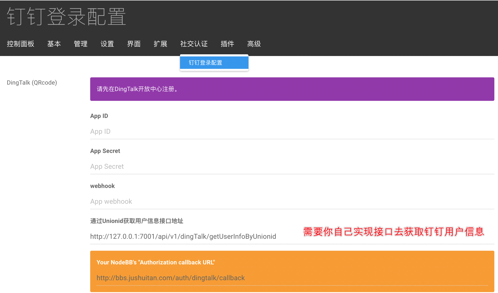
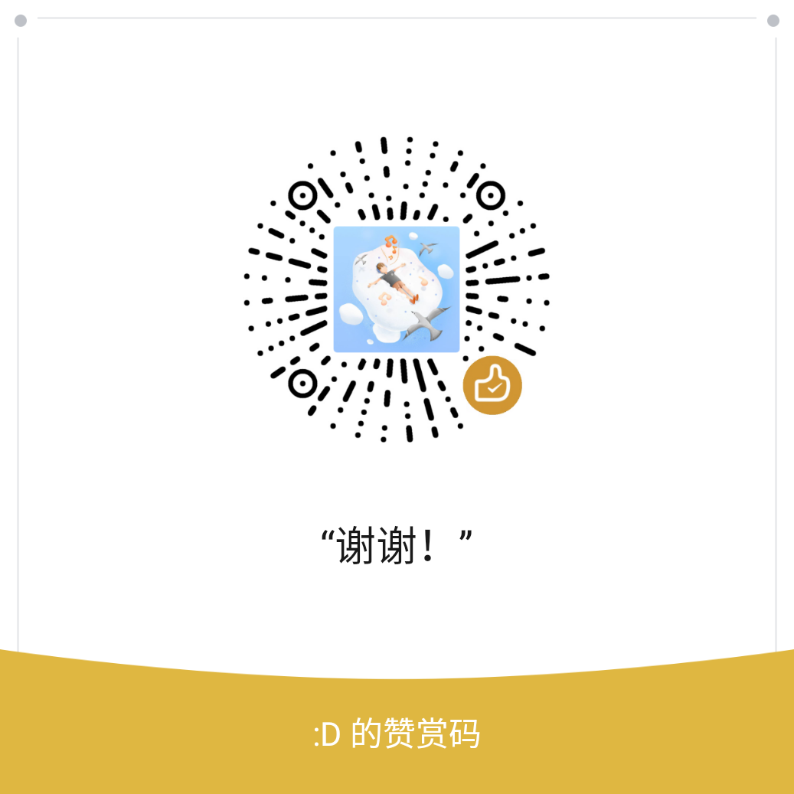

## Nodebb Plugin Dingtalk Login Business

NodeBB 钉钉二维码登录插件,接入接口实现企业用户信息获取。
钉钉登录
## 安装

    $ npm install nodebb-plugin-dingtalk-login-business
    
## 使用

OAuth2.0网页授权，使用此接口须通过钉钉开放平台认。

申请好 AppID 和 AppSecret 后进入 NodeBB 的 ACP 后台设置钉钉登录信息  

参考:  nodebb-plugin-dingtalk-login
在此基础上，通过自己实现接口(getUserInfoByUnionid)获取企业用户信息。


POST接口,入参出参。

```javascript
// 接口入参 ，unionid 会根据 AppId 和 AppSecret生成,正确在ACP中录入即可。
{unionid:unionid}

// 出参里的res.data(供参考)，具体要去钉钉开放平台勾选对应权限
// res.status 为 200 时

res.data = {
    active: true,
    admin: true,
    avatar: '',
    boss: false,
    dept_id_list: [123],
    dept_order_list: [{
        dept_id: 123,
        order: 123
    }],
    email: '',
    exclusive_account: false,
    extension: '{"岗位职级":"xx","花名":"xx"}',
    hide_mobile: false,
    hired_date: 123456,
    job_number: '123',
    leader_in_dept: [{
        dept_id: 123,
        leader: false
    }],
    mobile: '123',
    name: 'xx（xx）',
    org_email: '',
    real_authed: true,
    remark: '',
    role_list: [{
        group_name: '职务',
        id: 123,
        name: ''
    }, {
        group_name: '默认',
        id: 123,
        name: ''
    }],
    senior: false,
    state_code: '123',
    telephone: '',
    title: '123',
    union_emp_ext: {},
    unionid: 'xxx',
    userid: 'xxx',
    work_place: 'xx'
}


```

#### 写插件不易，如果对您有帮助，请打赏，谢谢🙏！
